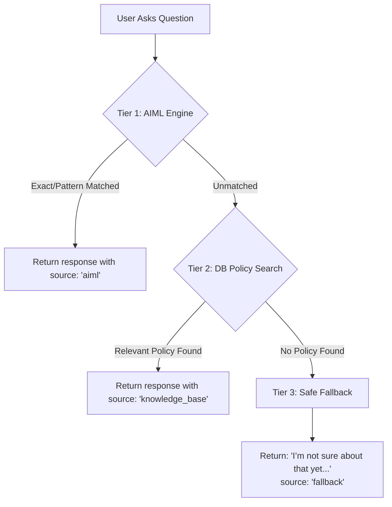

# AIML Chatbot for Intern Support — Developer & Architecture Guide

## Overview

InternOps includes a high-performance **Artificial Intelligence Markup Language (AIML)** chatbot engine built to provide instant, automated support for new and existing interns.

The chatbot answers common queries across:

- **Intern Onboarding**: Starting internship, post-joining steps, required documents, onboarding checklists, mentor orientation.
- **Company Policies**: Attendance criteria, working hours, leave policies, code of conduct & workplace rules.
- **Workflows & Procedures**: Task submission, proof uploads, status updates, mentor communication, project submissions.
- **InternOps Platform**: Dashboard navigation, profile updates, password changes, internship status tracking, certificates.
- **General Support**: Platform overview, helpdesk contacts, Aura rewards, and FAQ assistance.

---

## Architecture & Directory Structure

The AIML knowledge base and engine are structured modularly:

```
InternOps/
├── knowledge_base/
│   └── aiml/
│       ├── onboarding.aiml     # Onboarding & checklist intents
│       ├── policies.aiml       # Company policies & work hours
│       ├── workflow.aiml       # Task submissions & mentor contact
│       ├── internops.aiml      # Platform navigation & profile
│       ├── general.aiml        # Greetings, helpdesk, about info
│       └── fallback.aiml       # Safe fallback definition
└── backend/
    ├── knowledge_base/aiml/    # Backend copy for runtime resolution
    └── src/modules/chatbot/
        ├── aimlEngine.js       # Fast XML/AIML parser & pattern matcher
        ├── repository.js       # Database policy query & audit logger
        ├── service.js          # 3-tier fallback hierarchy coordinator
        └── routes.js           # Fastify POST /message endpoint
```

---

## AIML Category Structure & Syntax

AIML files follow the standard XML/AIML 1.0.1 specification:

```xml
<aiml version="1.0.1">
  <category>
    <pattern>HOW DO I START MY INTERNSHIP</pattern>
    <template>
      To start your internship: 1. Log in to InternOps. 2. Complete your profile. 3. Review your onboarding checklist.
    </template>
  </category>
</aiml>
```

### Supported Tags & Features

1. **`<category>`**: Encloses an individual question-and-answer rule.
2. **`<pattern>`**: The input pattern to match. Punctuation and case are normalized automatically.
3. **`<template>`**: The output text returned by the bot.
4. **`<srai>` (Recursive Redirection)**: Maps multiple query variations to a canonical pattern:
   ```xml
   <category>
     <pattern>HOW CAN I SUBMIT MY WORK</pattern>
     <template><srai>HOW DO I SUBMIT MY WORK</srai></template>
   </category>
   ```
5. **`<random>` & `<li>`**: Delivers varied responses naturally:
   ```xml
   <category>
     <pattern>HELLO</pattern>
     <template>
       <random>
         <li>Hello! How can I help you today?</li>
         <li>Hi there! Welcome to InternOps.</li>
       </random>
     </template>
   </category>
   ```
6. **`*` Wildcards & `<star/>` Variables**: Captures variable words and injects them into responses.

---

## 3-Tier Fallback Mechanism

To ensure safe, non-hallucinatory answers, the chatbot coordinates queries through a 3-tier fallback hierarchy:



1. **Tier 1 (AIML Engine)**: Matches user input locally against indexed AIML patterns (< 5ms response time).
2. **Tier 2 (Knowledge Base / Database)**: Queries active PostgreSQL policy documents if the query cannot be resolved via AIML.
3. **Tier 3 (Safe Fallback)**: Returns a standardized safe response without guessing:
   > _"I’m not sure about that yet. Please try rephrasing your question or contact your mentor/support team."_

---

## Chatbot API Reference

### Endpoint

`POST /api/v1/chatbot/message` _(Alias: `POST /api/chatbot/message`)_

### Authentication

Requires a valid Bearer JWT token in the `Authorization` header. Accessible to all user roles (`INTERN`, `CAPTAIN`, `TL`, `SENIOR_TL`, `ADMIN`, `HR`).

### Request Body

```json
{
  "message": "How do I submit my work?"
}
```

### Success Response (`200 OK`)

```json
{
  "response": "You can submit your work through InternOps: 1. Go to Tasks in the sidebar. 2. Select your assigned task. 3. Click 'Upload Proof'...",
  "source": "aiml"
}
```

### Fallback Response (`200 OK`)

```json
{
  "response": "I’m not sure about that yet. Please try rephrasing your question or contact your mentor/support team.",
  "source": "fallback"
}
```

### Validation Error (`400 Bad Request`)

```json
{
  "error": "Validation error",
  "message": "Message cannot be empty",
  "details": [ ... ]
}
```

---

## How to Add a New FAQ Category

1. Open the relevant file in `knowledge_base/aiml/` (e.g. `policies.aiml` or `onboarding.aiml`).
2. Add the canonical category with the main response:
   ```xml
   <category>
     <pattern>WHAT IS THE DRESS CODE</pattern>
     <template>
       Our dress code is smart casual for virtual and in-office meetings. Professional attire is expected for client presentations.
     </template>
   </category>
   ```
3. Add common query variations using `<srai>`:
   ```xml
   <category>
     <pattern>DRESS CODE POLICY</pattern>
     <template><srai>WHAT IS THE DRESS CODE</srai></template>
   </category>

   <category>
     <pattern>* DRESS CODE *</pattern>
     <template><srai>WHAT IS THE DRESS CODE</srai></template>
   </category>
   ```
4. Copy or sync changes to `backend/knowledge_base/aiml/`.
5. Run the test suite:
   ```bash
   npm --prefix backend test -- tests/unit/chatbot.aiml.test.js
   ```

---

## Running Locally and Testing

### Run Backend Unit & Integration Tests

```bash
# In backend directory
npm test -- tests/unit/chatbot.aiml.test.js tests/integration/chatbot.test.js
```

### Run Module Structure Lint

```bash
# In backend directory
node scripts/lint-modules.js
```

### Run Frontend Vitest Tests

```bash
# In frontend directory
npm test -- src/__tests__/FloatingChatbot.test.jsx
```
